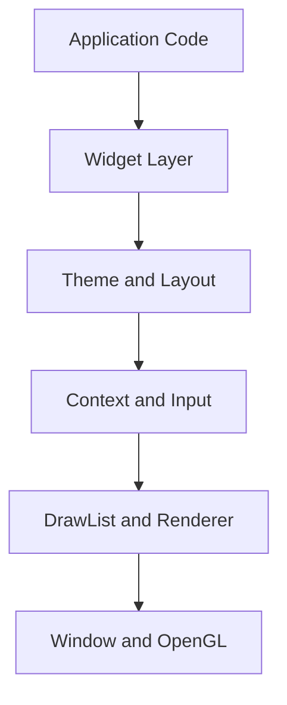

# Library Architecture

Fastener uses a hybrid architecture that combines immediate-mode simplicity with retained-mode polish and persistent state management.

## High-Level Structure

The library is organized into four layers:

1. Platform layer (Window): OS-specific window creation, OpenGL context, input events.
2. Core layer (Context, InputState): frame lifecycle, widget IDs, focus, interaction.
3. Graphics layer (DrawList, Font, Texture, Renderer): low-level rendering and batching.
4. UI layer (Theme, Style, Layout): styling and layout primitives.



## The Immediate-Mode Paradigm

You declare your UI every frame inside the application loop. Widgets are lightweight function calls that:

1. Read input state.
2. Update per-widget state using widget IDs.
3. Emit draw commands to the DrawList.
4. Return interaction results (e.g., clicked or changed).

Example:

```cpp
if (fst::Button(ctx, "Save")) {
    saveDocument();
}
```

## Core Components

### `fst::Context`

The context tracks:

- Focus and hover state
- Time and delta time
- ID stack for hierarchical widgets
- Layout and docking state
- Deferred rendering for popups and overlays

### `fst::DrawList`

The DrawList is a command buffer for geometry. Widgets push rectangles, lines, and text into it each frame. The renderer then submits batched draw calls to OpenGL.

### `fst::Window`

Wraps the OS window and input events. It also exposes clipboard and cursor APIs used by widgets.

## Rendering Pipeline

Fastener uses an OpenGL 3.3 pipeline:

1. Batch geometry into vertex/index buffers.
2. Use a font atlas generated from TTF files.
3. Apply scissor clipping for nested panels and scroll areas.
4. Defer popups/tooltips so they render on top.

## The ID System

Widgets are identified via a hash-based ID system:

- A string ID (e.g., "login_button") is hashed into a `WidgetId`.
- The ID stack combines parent/child IDs (pushId/popId).
- This allows widgets like TextInput to keep cursor state across frames.

---
Next: API.md
