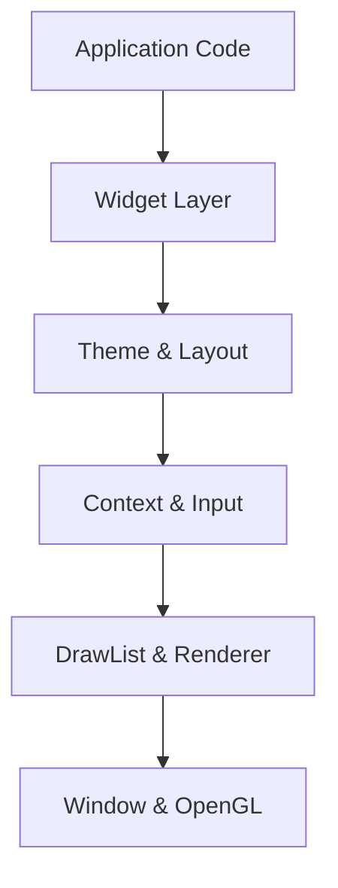

# Library Architecture

Fastener is designed with a hybrid architecture that combines **Immediate-Mode UI (IMUI)** simplicity with **Retained-Mode** polish and persistent state management.

## 🏗 High-Level Structure

The library is organized into four main layers:

1.  **Platform Layer** (`Window`): Abstracts OS-specific window creation, OpenGL context management, and event handling.
2.  **Core Layer** (`Context`, `InputState`): Manage the lifecycle of a frame, widget IDs, focus, and user interaction.
3.  **Graphics Layer** (`DrawList`, `Font`, `Texture`, `Renderer`): Handles low-level geometry generation and OpenGL communication.
4.  **UI Layer** (`Theme`, `Style`, `Layout`): High-level systems for aesthetics and positioning.

## 🧠 The "Immediate-Mode" Paradigm

In Fastener, you "declare" your UI every frame inside the application loop. You don't create long-lived widget objects. Instead, you call functions like `fst::Button()` that:
1.  **Poll Input**: Check if the mouse is over the button's bounds.
2.  **Update State**: Determine if the button is hovered, pressed, or clicked.
3.  **Queue Drawing**: Tell the `DrawList` to add rectangles and text for rendering.
4.  **Return Feedback**: Return `true` if the button was clicked.

## 🔑 Core Components

### `fst::Context`
The "brain" of the library. It tracks:
- **Focus**: Which widget is currently typing or active.
- **Hover**: Which widget is under the mouse.
- **Time**: Global clock for animations.
- **ID Stack**: Manages hierarchical widget IDs to prevent collisions.

### `fst::DrawList`
A command buffer that collects geometry. Instead of calling OpenGL for every rectangle, Fastener's widgets push "vertices" and "indices" into the `DrawList`. At the end of the frame, the `Renderer` sends this data to the GPU in optimized batches.

### `fst::Window`
Wraps the OS window. It's responsible for converting native events (like `WM_LBUTTONDOWN`) into `fst::InputState` messages that the library understands.

## 🎨 Rendering Pipeline

Fastener uses a modern OpenGL 3.3 pipeline:
1.  **Batching**: All rectangles and standard shapes are combined into a single vertex buffer.
2.  **Font Atlas**: Text characters are read from a dynamic texture atlas generated at runtime from `.ttf` files.
3.  **Clipping**: A hardware clip-rect (Scissor test) stack allows for nested scroll areas and panels without content overflow.
4.  **Deferred Rendering**: Tooltips and popups are recorded and rendered *after* the main UI to ensure they appear on top.

## 🆔 The ID System

Since widgets are temporary function calls, Fastener uses a hashing system to identify them across frames.
- A unique string ID (e.g., `"login_button"`) is hashed to a `WidgetId` (uint64).
- Hierarchical IDs are created by combining parent and child hashes (using `pushId()`/`popId()`).
- This allows a `TextInput` to persist its cursor position even though only its function is called every frame.

---
[Next: API Reference →](API.md)
